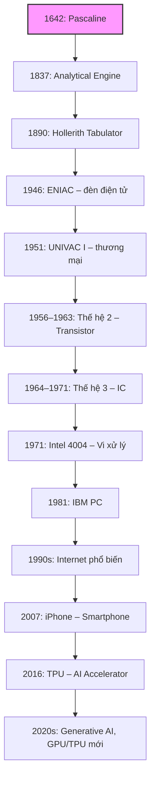

## Lịch sử phát triển máy tính

```mermaid
flowchart TB
    A[1642: Pascaline] --> B[1837: Analytical Engine]
    B --> C[1890: Hollerith Tabulator]
    C --> D[1946: ENIAC – đèn điện tử]
    D --> E[1951: UNIVAC I – thương mại]
    E --> F[1956–1963: Thế hệ 2 – Transistor]
    F --> G[1964–1971: Thế hệ 3 – IC]
    G --> H[1971: Intel 4004 – Vi xử lý]
    H --> I[1981: IBM PC]
    I --> J[1990s: Internet phổ biến]
    J --> K[2007: iPhone – Smartphone]
    K --> L[2016: TPU – AI Accelerator]
    L --> M[2020s: Generative AI, GPU/TPU mới]
    style A fill:#f9f,stroke:#333,stroke-width:2px
```