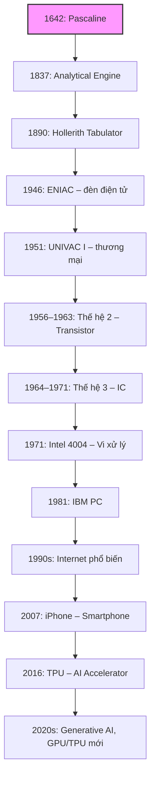
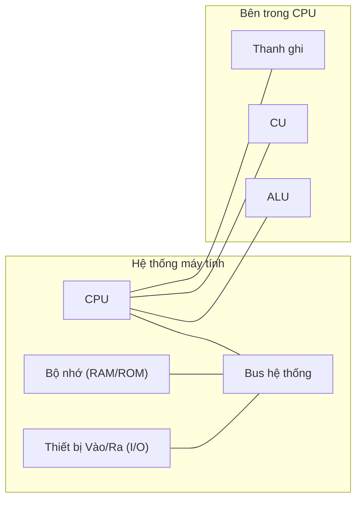
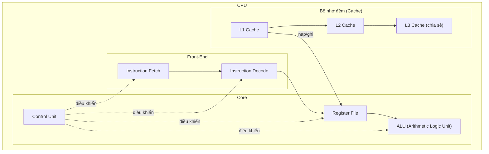
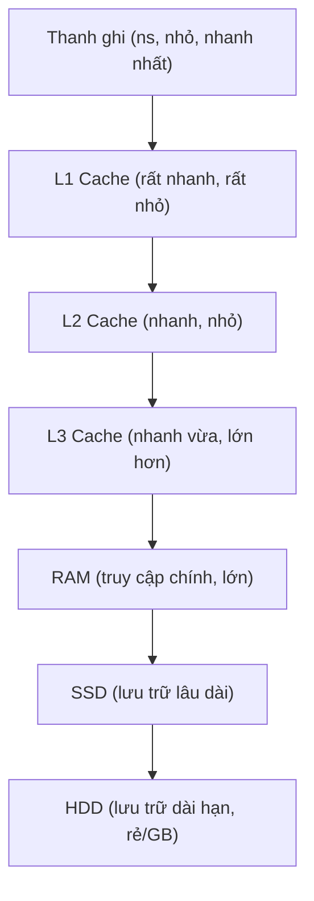
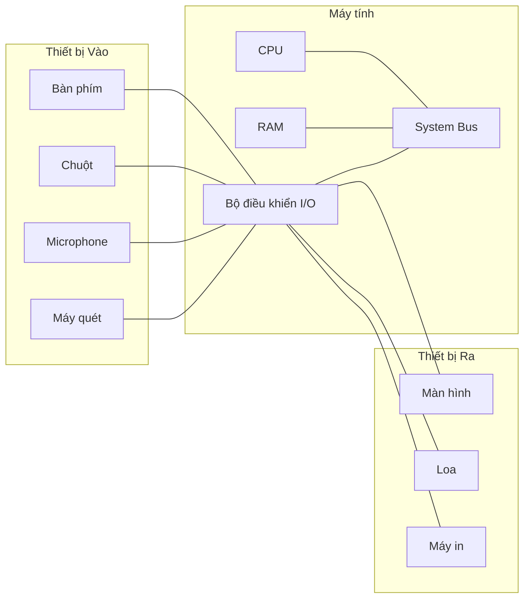
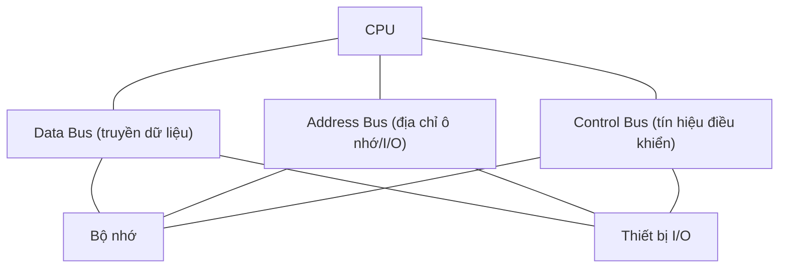
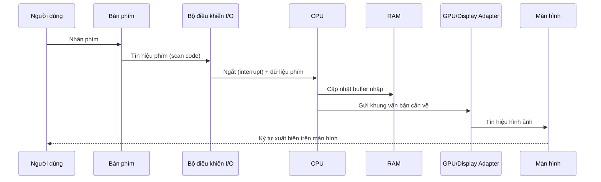

## Lịch sử phát triển máy tính

***
### Tổng quan hệ thống máy tính

### Cấu trúc bên trong CPU (ALU, CU, Thanh ghi, Cache)

### Phân cấp bộ nhớ (tốc độ nhanh → chậm)

### Thiết bị vào/ra và Bộ điều khiển I/O

### Bus hệ thống (Data/Address/Control)

### Chu trình nhập phím → hiển thị (Sequence Diagram)

